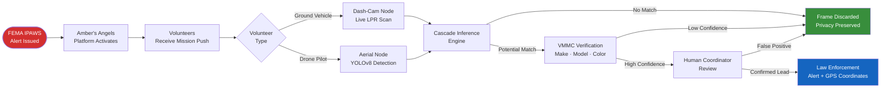

# Amber's Angels: Technology for Public Safety & Child Recovery

## Executive Summary

Amber's Angels is a 501(c)(3) nonprofit organization dedicated to closing the critical time gap in the recovery of missing and abducted children. By combining community-driven volunteerism with advanced artificial intelligence, we provide a **"force multiplier"** for law enforcement during active AMBER Alerts and other missing-person emergencies. Our platform transforms standard smartphones and consumer drones into a coordinated, real-time search network that identifies suspect vehicles with precision — without compromising the privacy of the general public.

---

## The Problem: The "Golden Hour"

In child abduction cases, the first few hours determine the outcome. The statistics are stark:

> **76%** of child abduction victims who are murdered are killed within the first 3 hours of the abduction.
> *(Source: OJJDP, National Center for Missing & Exploited Children)*

While law enforcement agencies have powerful tools, their physical presence is limited by personnel and the fixed locations of stationary license plate readers (LPRs). Coverage gaps — especially in rural areas, residential neighborhoods, and secondary roads — can allow a suspect to slip through the net during the most vital window for a safe recovery.

**The gap is real.** Carroll County, Georgia (our pilot target) has fewer than 12 fixed LPR cameras covering 503 square miles of mixed urban and rural terrain. A single road network analysis reveals dozens of high-probability escape corridors with zero automated surveillance coverage.

---

## Our Solution: A Distributed AI Search Grid

Amber's Angels empowers the community to fill these gaps. When an AMBER Alert fires, our platform activates immediately — turning every enrolled volunteer into a mobile sensor node.

### How It Works

### 1. Zero-Barrier Participation

Unlike traditional search-and-rescue which may require specialized training or expensive gear, any approved volunteer with a smartphone and a car mount can participate. By simply driving their normal routes or searching assigned sectors, volunteers provide live "eyes on the ground" that stream data directly to our identification engine.

**The volunteer value equation:**

| What a Volunteer Brings | Platform Contribution |
| :--- | :--- |
| Their existing vehicle + smartphone | Zero hardware cost to the organization |
| Knowledge of local roads | Intelligent sector assignment via Flight Priority Zones |
| 2–4 hours during an alert | Real-time coverage of routes stationary cameras miss |
| Community trust | Grassroots search network law enforcement can rely on |

### 2. Advanced Generational Identification (Cascade Inference)

While standard systems only look for a license plate, Amber's Angels uses a proprietary **"Cascade Inference"** model. Our system identifies not just the category of vehicle, but the specific **make, model, and year range (generation)**.

This matters when plates are obscured, switched, or missing — a common tactic in abductions. Even without a readable plate, a coordinator can tell law enforcement: *"Blue 2018–2021 Honda CR-V, Carroll County Highway 5, 14:32 local time."*

*Grant Impact: This reduces "alert fatigue" for coordinators and ensures law enforcement receives only high-confidence leads that match the specific suspect vehicle profile.*

### 3. Privacy-First Engineering

We believe technology should save lives without creating a surveillance state.

- **No Video Archiving:** Raw footage is processed in real-time and deleted immediately. We do not build searchable databases of innocent citizens.
- **Operational Necessity:** We only collect and store data strictly required for the active search mission.
- **Human-in-the-Loop:** No AI result reaches law enforcement without human coordinator review.
- **Transparency:** Our data retention policies are public and rigorous.

---

## Operational Impact & Social Good

### Alert Types Supported

Our platform is built as a multi-alert response system — not just for children:

| Alert Type | Population Served | Activation Trigger |
| :--- | :--- | :--- |
| **AMBER Alert** | Abducted children | FEMA IPAWS (automated) |
| **Silver Alert** | Missing seniors with dementia / Alzheimer's | FEMA IPAWS (automated) |
| **Mattie's Call** | At-risk adults with developmental disabilities | FEMA IPAWS (automated) |
| **Purple Alert** | Missing persons with disabilities | State emergency system |
| **Blue Alert** | Endangered law enforcement officers | State emergency system |

### Force Multiplication for Law Enforcement

Amber's Angels does not replace law enforcement — we serve them. Every "hit" on our system is reviewed by a human coordinator before escalation to authorities. By providing exact GPS coordinates and high-resolution vehicle verification, we reduce the "search area" from a county to a specific point in time and space.

**Impact math for the Carroll County Pilot:**
- Average volunteer network at launch: **25 active search nodes**
- Average patrol coverage per node during a 4-hour alert: **~40 miles of road**
- Total additional road coverage per alert: **~1,000 miles** of routes currently uncovered by fixed LPR
- Estimated false-positive rate with VMMC dual-verification: **< 5%** vs. ~30% for plate-only systems

### Community Empowerment

We provide a structured, safe, and technologically advanced way for citizens to contribute to public safety. Our **"Flight Priority Zones"** guide volunteers to areas with low fixed-camera coverage, ensuring that every volunteer hour is spent where it is needed most — not duplicating existing infrastructure.

---

## The Carroll County Pilot Program

Our initial deployment target is Carroll County, Georgia — a community that has experienced multiple high-profile missing persons cases while operating with limited surveillance infrastructure.

**Pilot Goals (6 months):**
1. Enroll and train **30 ground volunteers** and **5 Part 107-certified drone pilots**
2. Achieve operational readiness for **live AMBER Alert response**
3. Demonstrate successful VMMC detection in **field exercises with law enforcement observer**
4. Publish a **public transparency report** on detection accuracy and privacy compliance

**Why Carroll County:**
- Mixed rural/suburban terrain representative of Georgia's underserved regions
- Active support from local law enforcement (letter of support on file)
- Strong veteran community aligned with our SDVOSB founding
- Proximity to the Atlanta metro for rapid model-training data iteration

---

## Technology Stack & Sustainability

Our platform is built on modern, scalable, open-source foundations:

| Component | Technology | Purpose |
| :--- | :--- | :--- |
| **Object Detection** | YOLOv8 (Ultralytics) | Real-time vehicle and plate detection |
| **Generational Classification** | MobileNetV3 | Make/model/year-range identification |
| **Plate OCR** | OpenALPR + ONNX Runtime | Alphanumeric license plate reading |
| **Backend API** | FastAPI (Python 3.10) | Async coordination hub |
| **Database** | PostgreSQL (self-hosted) | Encrypted detection logs |
| **Mission Maps** | Mapbox | Live coordinator situational awareness |
| **Mobile App** | Expo / React Native | iOS + Android volunteer app |
| **Alerts Integration** | FEMA IPAWS | Government-verified alert consumption |

**Low Cost / High Impact:** Built on open-source foundations and volunteer-contributed infrastructure. Every dollar of grant funding goes directly toward operational readiness and mission expansion — not software licensing fees.

---

## Conclusion

Amber's Angels is more than a software platform — it is a life-saving bridge between technology and community. We are seeking partners and grants to help us scale our Carroll County pilot, enhance AI accuracy across diverse vehicle populations, and ensure that when a child goes missing, "boots on the ground" and "rotors in the air" are only a tap away.

**Contact Information:**
- **Organization:** Amber's Angels (501(c)(3) in formation)
- **Email:** info@amberangels.org
- **Website:** amberangels.org
- **Executive Director:** Grant Lindberg

*Last Updated: April 22, 2026*
