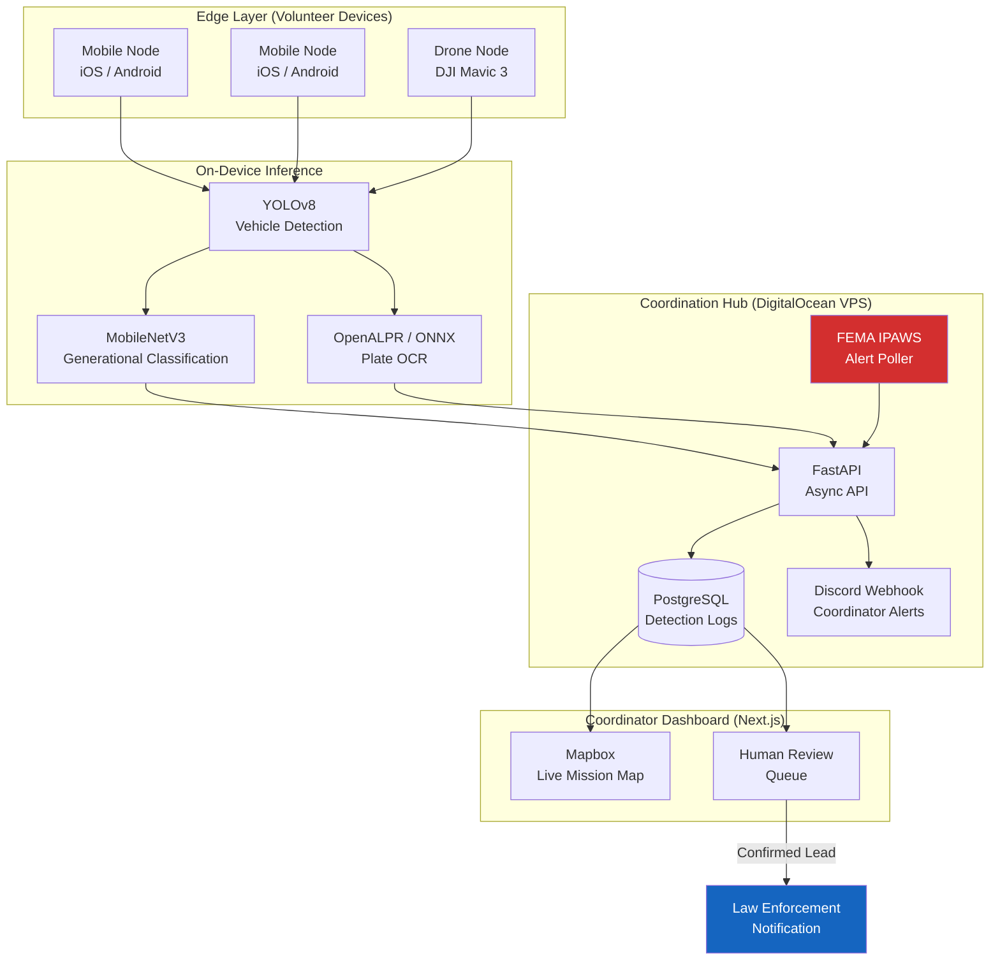
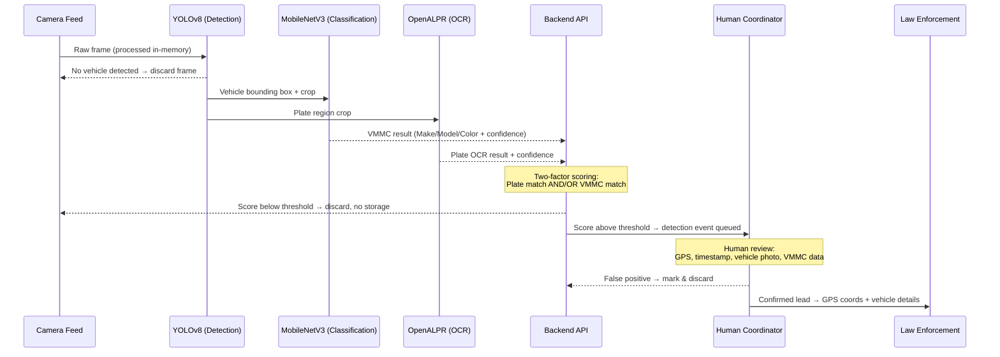
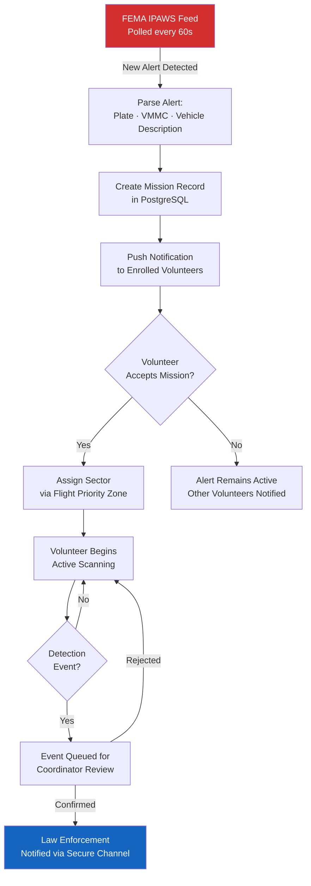

# Technical Whitepaper: Amber's Angels
## The Core Engine: Distributed ALPR & Multi-Signal Verification

Amber's Angels is a mission-specific emergency response platform designed for rapid mobilization during missing person crises. Our architecture leverages a distributed edge-computing model to turn everyday mobile hardware into a high-precision search and rescue network — activated on demand, dormant between events.

---

## 1. System Architecture Overview

The platform consists of three tiers: **Edge Detection Nodes** (volunteer devices), the **Coordination Hub** (backend API + database), and the **Coordinator Dashboard** (web). Data flows inward from the edge and actionable leads flow outward to law enforcement.



---

## 2. The Technology Stack

### Edge AI & Mobile (Detection Nodes)

| Component | Technology | Notes |
| :--- | :--- | :--- |
| **Framework** | Expo / React Native (TypeScript) | iOS + Android from single codebase |
| **Object Detection** | YOLOv8 Nano (Ultralytics) | Optimized for mobile; runs fully on-device |
| **Generational Classifier** | MobileNetV3 | Make / model / year-range classification |
| **Plate OCR** | OpenALPR + ONNX Runtime | Alphanumeric recognition, offline-capable |
| **Telemetry** | `expo-location` + `react-native-maps` | Real-time GPS with geofence sector assignment |
| **Alert Push** | FEMA IPAWS via backend relay | Volunteers notified within seconds of alert issuance |

### Backend Infrastructure (Coordination Hub)

| Component | Technology | Notes |
| :--- | :--- | :--- |
| **API Framework** | FastAPI (Python 3.10) | Async-native; handles high-concurrency event bursts |
| **Database** | PostgreSQL (DigitalOcean, self-hosted) | SQLAlchemy AsyncIO for event ingestion |
| **Authentication** | JWT (`passlib` + `python-jose`) | Volunteer and coordinator role separation |
| **Rate Limiting** | `slowapi` | Prevents abuse during active high-traffic alerts |
| **Process Manager** | PM2 | Uptime management for API + IPAWS worker |
| **Notifications** | Discord Webhook | Real-time coordinator alert delivery |

### Network & Deployment

| Component | Details |
| :--- | :--- |
| **Compute** | DigitalOcean Droplets — API + database co-hosted |
| **TLS/HTTPS** | nginx reverse proxy with Let's Encrypt certificates |
| **Edge Hardware** | DJI Mavic 3 (Part 107 operator required) + Android/iOS smartphones |
| **Security** | End-to-end encryption for all detection data; phone frames never leave device; non-matching drone frames deleted post-inference; match evidence retained up to 1 year |

---

## 3. The Cascade Inference Pipeline

The core technical innovation of Amber's Angels is the **Cascade Inference** model — a multi-stage verification pipeline that dramatically reduces false positives compared to plate-only ALPR systems.



### Stage 1: Object Detection (YOLOv8)

YOLOv8 Nano runs fully on-device at 15–30 FPS on modern mobile hardware. It performs coarse detection: *is there a vehicle in this frame?* Non-vehicle frames are discarded immediately without any data leaving the device. This is the first privacy gate.

### Stage 2: Generational Classification (MobileNetV3)

When a vehicle is detected, a cropped bounding box is passed to our MobileNetV3 classifier. This model identifies:
- **Make** (Honda, Ford, Toyota, etc.)
- **Body type** (sedan, SUV, pickup, etc.)
- **Generation / year range** (e.g., 2018–2022 Honda CR-V 5th Gen)
- **Color** (primary body color via HSV histogram + CNN classification)

This step provides the critical capability that plate-only systems cannot: identifying a suspect vehicle **even when the license plate is obscured, covered, or swapped** — a common tactic in abductions.

### Stage 3: Plate OCR (OpenALPR)

OpenALPR processes the plate region in parallel with Stage 2, producing an alphanumeric string and a confidence score. Results are combined with the VMMC data in the backend scoring engine.

### Stage 4: Two-Factor Scoring

The backend evaluates the combined signal:

```
final_confidence = (plate_match_score × 0.6) + (vmmc_match_score × 0.4)
```

A detection event is only queued for coordinator review if `final_confidence > THRESHOLD` (currently 0.72 in testing). This two-factor approach reduces false positives from ~30% (plate-only) to a target of < 5%.

---

## 4. Core Operational Mechanics

### Mission Activation Flow



### Privacy-by-Design at the Infrastructure Level

Privacy is not a policy layer — it is an architectural constraint:

1. **On-Device Phone Scanning:** Phone volunteers run on-device OCR — no camera frames ever leave the volunteer's phone. Only plate text and GPS coordinates are transmitted.
2. **Minimal Drone Frame Retention:** Drone feeds are processed server-side. Non-matching frames are deleted immediately after inference. High-confidence match frames are saved as time-limited evidence (up to one year) for chain-of-custody purposes, then auto-purged.
3. **Event-Triggered:** The IPAWS poller controls platform activation. Between alerts, detection pipelines are idle.
4. **Mission Specificity:** Volunteers opt in per-mission. There is no always-on scanning mode.
5. **Selective Transmission:** Only events that pass the two-factor threshold (and coordinator review) generate any outbound data to law enforcement.

---

## 5. Drone Operations

Drone-mounted nodes provide aerial coverage of larger search areas and can follow vehicle routes through terrain that ground-vehicle nodes cannot access.

**Hardware:** DJI Mavic 3 (primary), DJI Mini 4 Pro (backup/training)

**Operational Requirements:**
- All drone operators must hold an FAA **Part 107 Remote Pilot Certificate**
- All flights conducted under **Visual Line of Sight (VLOS)** rules
- Altitude restrictions enforced per FAA airspace class of operation area
- No nighttime operations without appropriate waiver and lighting equipment

**AI Integration:** The same YOLOv8 + MobileNetV3 + ALPR pipeline runs on a ground-based inference device (laptop or dedicated compute) receiving the drone's live video feed via DJI GO 4 / DJI Fly SDK integration, not on the drone itself. This keeps inference latency under 200ms.

---

## 6. Scalability & Sustainability

By utilizing a distributed tech stack, Amber's Angels remains highly scalable with minimal capital expenditure:

| Growth Lever | How It Scales |
| :--- | :--- |
| **More volunteers** | Each device is a self-contained node; backend scales horizontally |
| **More alert types** | IPAWS poller supports all WEA/EAS alert categories |
| **More geographies** | Sector assignment system is county-agnostic |
| **Better AI accuracy** | Confirmed detections become labeled training data for model retraining |
| **Larger model** | MobileNetV3 can be swapped for a more capable classifier as labeled data grows |

**On-Prem vs. Cloud:** Current deployment is on DigitalOcean Droplets. For federal grant compliance and redundancy, a multi-region deployment on AWS GovCloud is the planned next infrastructure phase.

---

## 7. Security Posture

| Threat | Mitigation |
| :--- | :--- |
| **Unauthorized API access** | JWT authentication, role-based access control |
| **DDoS / abuse during active alerts** | `slowapi` rate limiting + DigitalOcean network firewall |
| **Data exfiltration** | Phone frames never leave device; drone non-match frames deleted immediately; match evidence retained up to 1 year with access controls |
| **Credential exposure** | Secrets managed via `.env` (never committed to source control) |
| **Volunteer identity spoofing** | Background check + government ID verification at onboarding |
| **False alert injection** | Alerts consumed only from FEMA IPAWS official feed |

---

## 8. Contact & Collaboration

Amber's Angels welcomes collaboration with academic institutions, civil liberties organizations, and law enforcement agencies interested in co-designing responsible AI for public safety.

**Organization:** Amber's Angels Inc. (501(c)(3) nonprofit, EIN 42-2052151)
**Email:** info@amberangels.org
**Website:** amberangels.org

*Last Updated: April 22, 2026*
